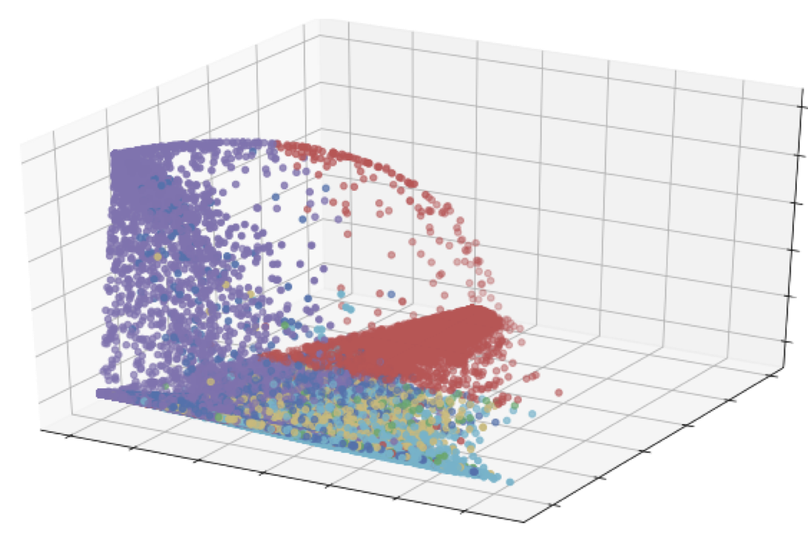

# Motivating question
Given a stream of data, how do we cluster it into topics?  

# Initialization
To initialize the repository and launch Jupyer notebooks for playing around:
```
python -m venv env  
. env/bin/activate  
pip install -r requirements.txt  
jupyter notebook
```
# Usage:
###### Offline clustering with TF-IDF, no preprocessing (notebook 01)
```
text = pd.read_csv('../data/talk_radio.csv')
clustering = Cluster(text.sentences)
results = clustering(method='kmeans', vectorizer=None,
                     reduce_dim=None, viz=True, n_clusters=10)
```

###### Online clustering with TF-IDF, preprocess text (notebook 02)
```
streamer = StreamData(filename='../data/talk_radio.csv', chunk=500, use_column='sentences')
init_text = streamer._init_data(10)
online = OnlineCluster(text=list(init_text.processed), method='kmeans', n_clusters=10)
num_batches = 25

for _ in tqdm(range(num_batches)):
    new_text = streamer()
    labels = online.predict(list(new_text.processed))
    fig = online.viz3D()
    # fig.savefig('../data/out-%s.png' % (str(datetime.now()).split(' ')[1]))

_ = online.top_terms(topx=10)
```

###### Online clustering with Continuous Bag of Words, no preprocessing (notebook 03)
```
streamer = StreamData(filename='../data/talk_radio.csv', chunk=1000, use_column=None)
init_text = list(streamer._init_data(5).sentences)
online = OnlineCluster(text=init_text, method='kmeans', n_clusters=25, vectorizer=CBoW(), viz=True)
```
